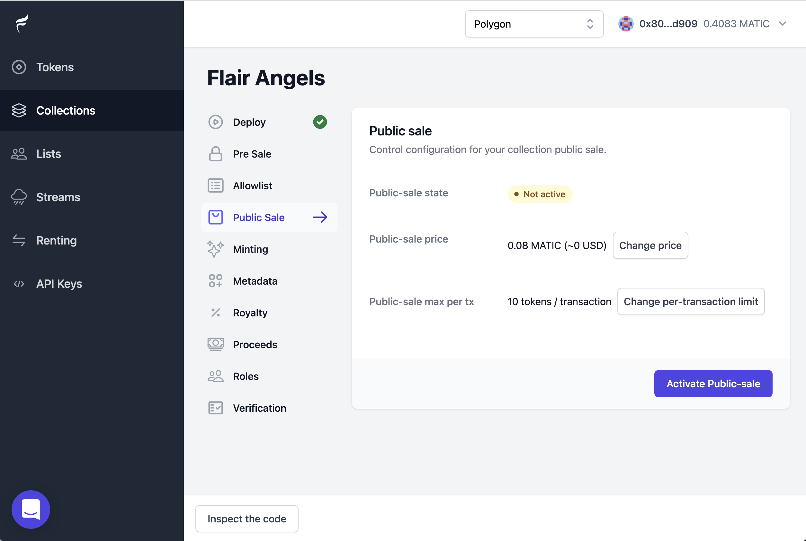
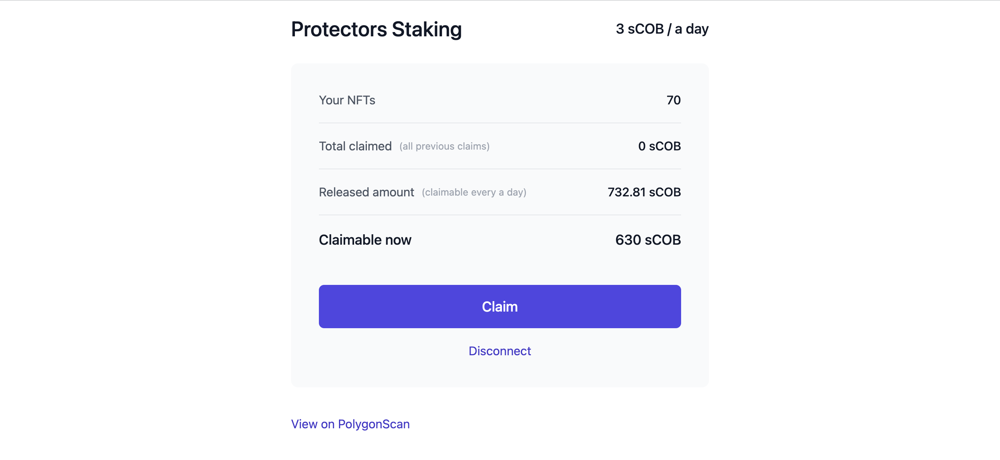

# NFT Collection Scaffold
[](https://twitter.com/intent/tweet?text=Production-ready%20%23NFT%20collection%20scaffold%20that%20will%20save%20you%20weeks%20of%20development%20work%20if%20launching%20an%20NFT%20project](https://github.com/0xflair/nft-collection-scaffold)) 

Production-ready code for a rarity-based PFP (a.k.a 10k avatar) collection on Ethereum, Polygon (Matic), Binance Chain and any other EVM-compatible chain.

This repository is uses [OpenZeppelin](https://www.openzeppelin.com) and [Flair](https://flair.finance/) contracts.

#### Current Features
* Ability to **reveal NFT metadata** after the mint, by uploading to IPFS.
* Deploy **ready-made smart contracts** to mainnet with a simple command.
* Ability to run pre-sales by allow-listing addresses.
* Controllable pre-sale, public sale and direct purchase toggles.
* Customizable maximum mints per transaction.
* Customizable maximum pre-sale mints per address.
* No gas fee for when collectors want to "list" NFTs from this collection. 
* Supports royalty for secondary sales on OpenSea, LooksRare, Rarible, and EIP2981 etc.

#### Stack
* Solidity 0.8.x ([OpenZeppelin](https://docs.openzeppelin.com/contracts/4.x/))
* Hardhat
* TypeScript

# :fire: Quick Start

If you want to create a new NFT Collection under 5 minutes, you can use Flair dashboard, which uses open-source smart contracts to deploy the contract for you, with your full ownership.

* Tutorial: [https://docs.flair.finance/tutorials/nft-sale](https://docs.flair.finance/tutorials/nft-sale)
* Dashboard: [https://app.flair.finance](https://app.flair.finance)

[](https://flair.finance)

# 🧗 Deploying the Hard Way

#### 1. Clone this repo

```sh
git clone https://github.com/0xflair/nft-collection-scaffold.git
```

#### 2. Create env variables

Copy the `.env.dist` file to a file named `.env`, and then edit it to fill in the details. Enter your Etherscan API key, your Infura Access Key, and the private key of the account which will send the deployment transaction.

#### 3. Create collection configuration

Copy `collection.config.js.dist` to a file named `collection.config.js`, then update the details based on your collection info, such as name, description, pre-reveal metadata and image.

#### 4. Deploy the contract using Hardhat

```sh
# On testnet
npm run deploy:rinkeby

# Or mainnet
npm run deploy:mainnet
```

## 😍 Are you looking for Staking?

Flair has a tutorial to create a staking pool under 5 minutes, [check it out here](https://docs.flair.finance/tutorials/nft-staking)!

[](https://docs.flair.finance/tutorials/nft-staking)

## :rocket: WAGMI
